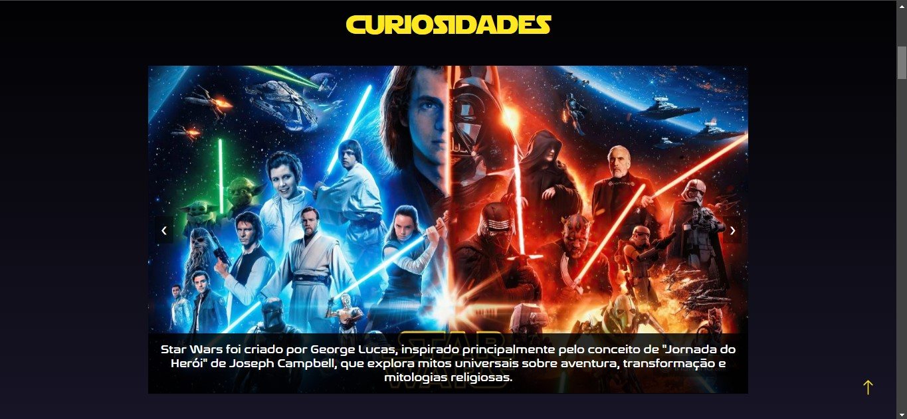
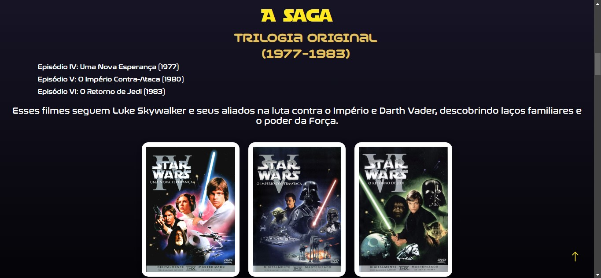
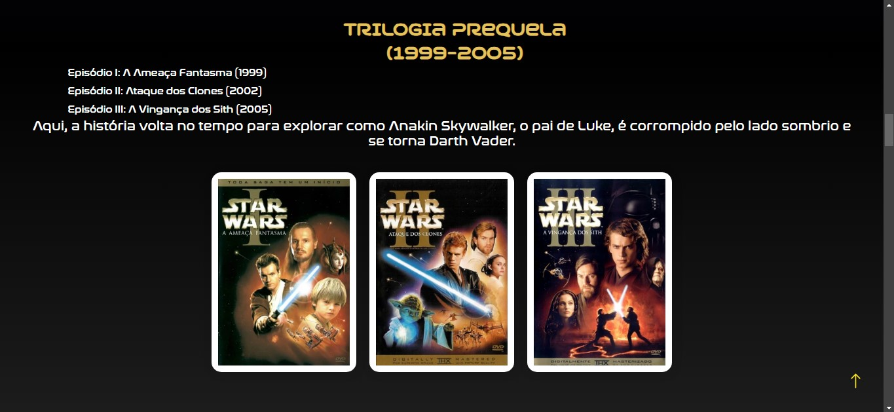
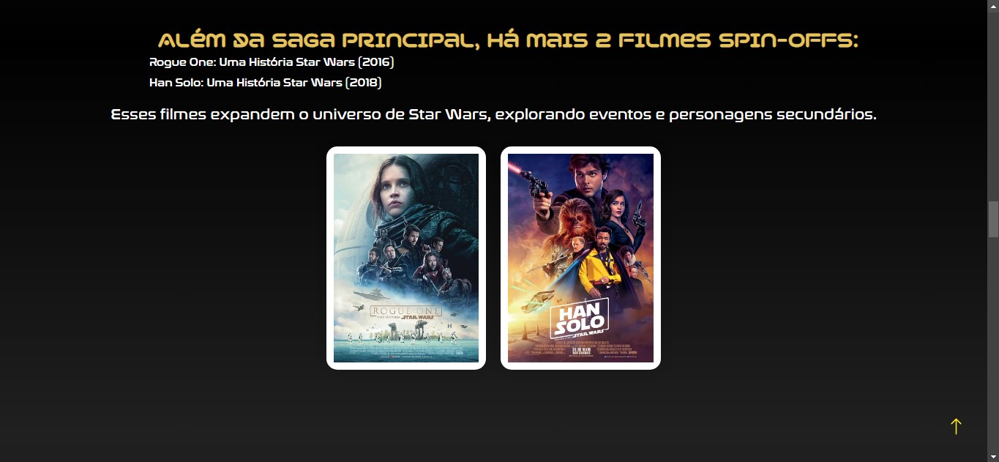
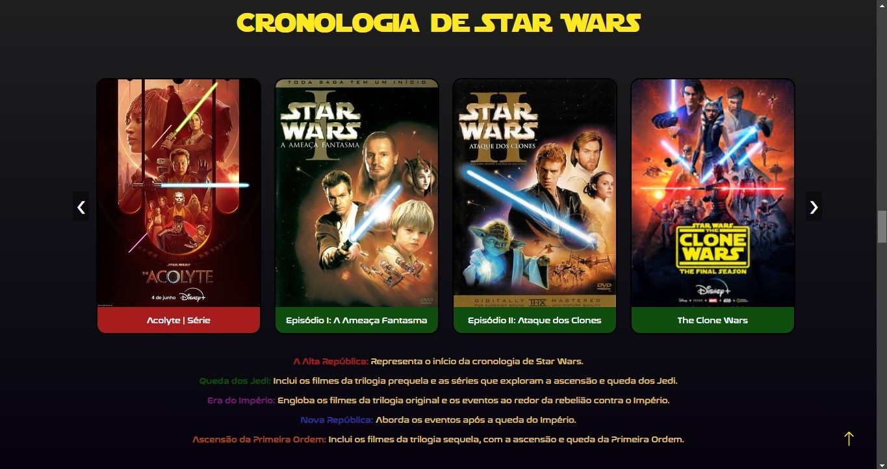
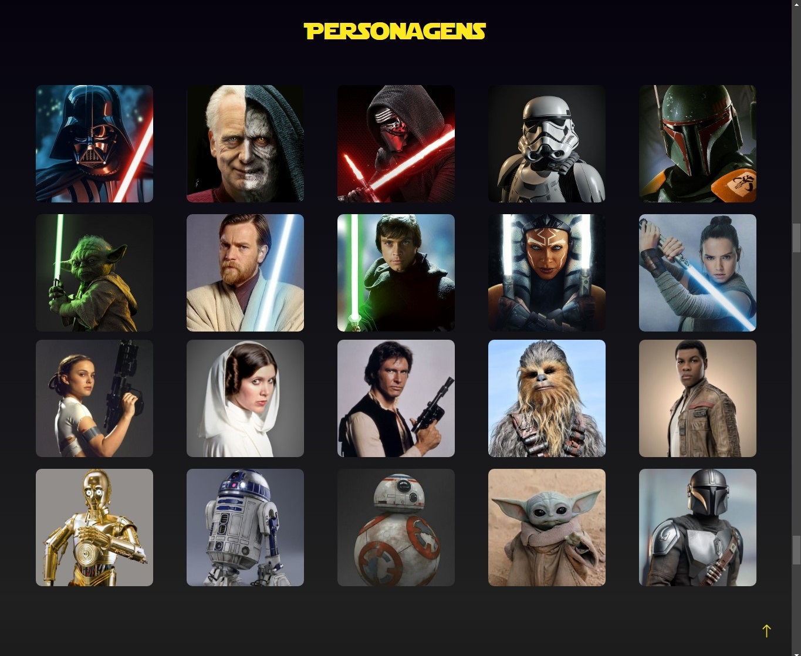
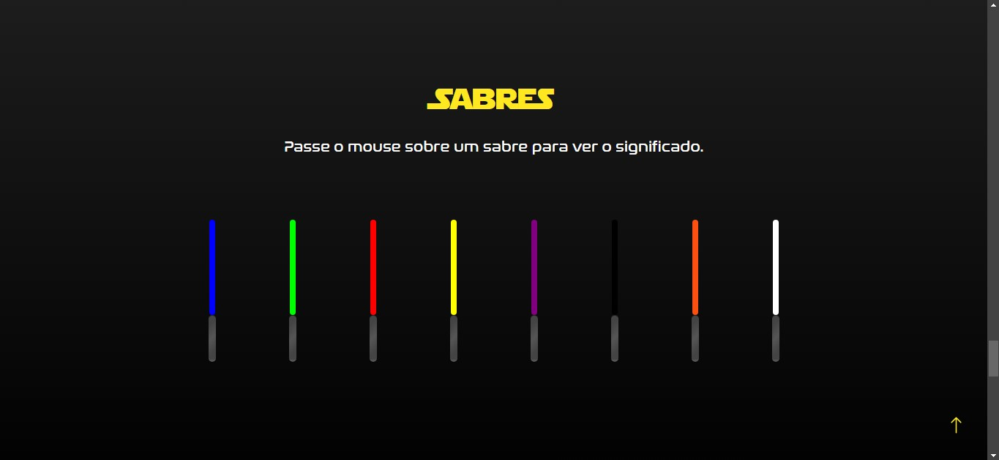
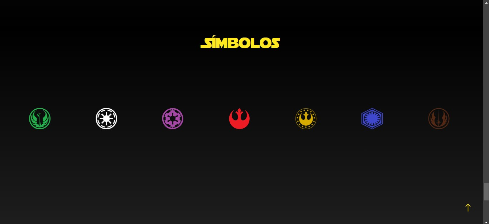

# Nome do Seu Site

Bem-vindo ao **[Arquivo Jedi]**, um projeto focado em trazer o mundo de Star Wars para os fãs com informações incríveis e visuais autênticos do universo da saga.

## Visão Geral

Este projeto foi desenvolvido utilizando **HTML**, **CSS** e um poquinho de JavaScript para criar uma experiência imersiva e fiel ao tema Star Wars. Confira o que você vai encontrar!

### Demonstração ao Vivo

Você pode acessar o site através deste [link](https://henriqueysm.github.io/Arquivo-Jedi/).

## Prévia

Abaixo estão algumas imagens mostrando o interior do site:

### Página Inicial

### Curiosidades 

### A Saga prt1

### A Saga prt2

### A Saga prt3

### A Saga prt4

### Seção de Cronologia

### Galeria de Personagens

### Sabres 

### Galeria de Símbolos de Star Wars

## Tecnologias Utilizadas
- **HTML**, **CSS** e **JS**: para estruturar, estilizar o site e dar funções
- **GitHub Pages**: para hospedar o site

---

Obrigado por visitar o site, e que a Força esteja com você! 🌌
